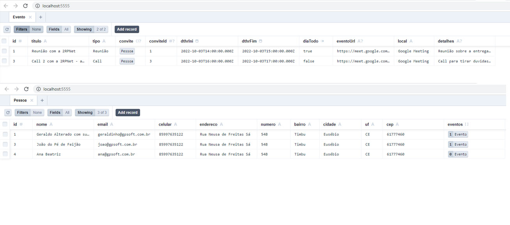
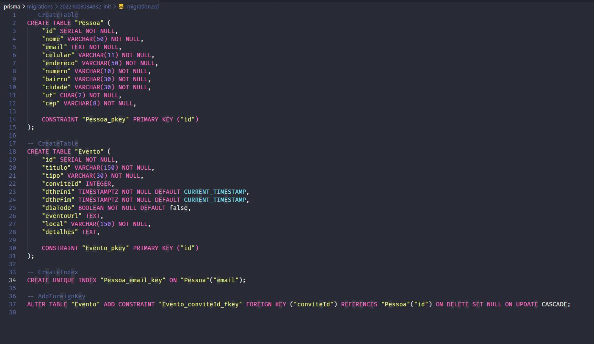
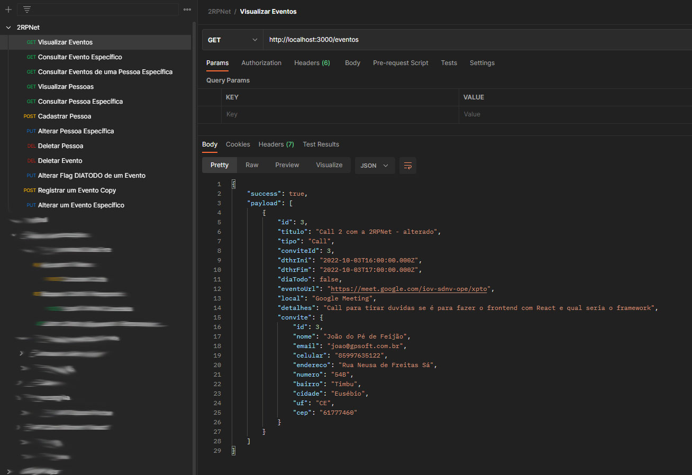

<p align="center">
  <a href="https://www.prisma.io/docs/" target="blank"></a>
</p>

# Descrição do Projeto
```
Backend em NodeJS usando Prisma com banco de dados Postgre.
Esta aplicação contém duas tabelas, Pessoas e Eventos, para registrar os eventos de determinadas pessoas.
```

## Usabilidade
```
npx ts-node src/index.ts
```

Acesse via.\
Endereço [http://localhost:3000](http://localhost:3000) no browser.

## Banco de Dados
 

## Schema SQL
 

## Postman
 

```
Para testar no Postman:
Arquivo: src/assets/2RPNet.postman_collection
```

## Suporte:
``` 
E-Mail:   gpatricio.melo@gmail.com 
WhatsApp: (85) 9 9763-5122
```
